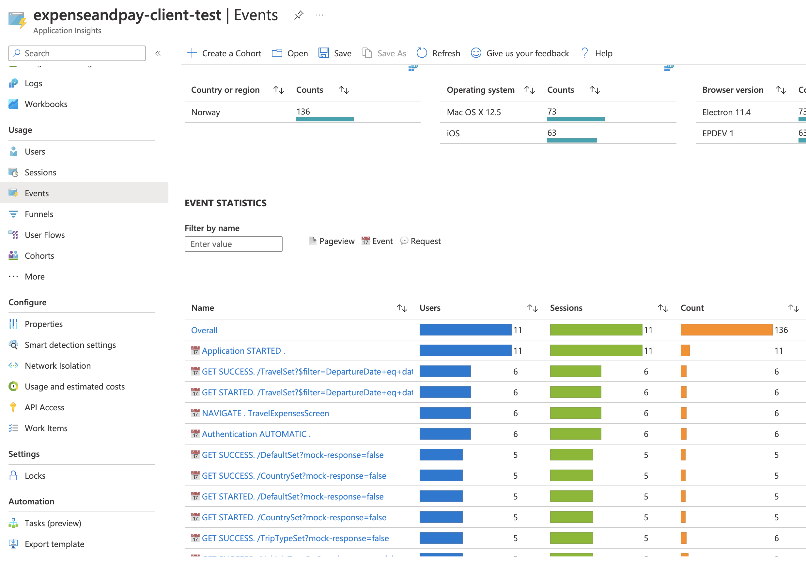

# AppInsights

### Before implementation

You need a resource in Azure you can use. Head to https://portal.azure.com, and head to AppInsights. Search for your application and see if it already has a resource you can use. If not, create one for each environment (dev, test, qa, prod). If your project wants to implement long term logging, you need an additional resource for each environment.

In order to connect to AppInsights, you need the instrumentation key or connection string from a resource. instrumentation keys are shorter, but might be deprecated in the future.

**_IMPORTANT: for any custom tracking/logging you add to your app, please make sure you don_**’**_t log sensitive information. Please also keep this in mind when looking at pull requests related to tracking._**

### Installation

You need to install some packages in your project to make this package work. We need `@microsoft/applicationinsights-react-js`, `@microsoft/applicationinsights-react-native`, and `@microsoft/applicationinsights-web`. `@microsoft/applicationinsights-react-native` also requires `react-native-device-info`:

```other
npm i @microsoft/applicationinsights-react-js @microsoft/applicationinsights-react-native @microsoft/applicationinsights-web react-native-device-info
```

### Implementation

First, you need to initiate appInsights on app startup. This can be done in a useEffect in App.tsx:

```tsx
import { appInsightsInit } from 'mad-expo-core';

export default function App() {
  useEffect(() => {
    appInsightsInit({
      instrumentationKey: 'KEY FROM ENV CONFIG',
    });
  }, []);

  return <>...</>;
}
```

If you want to use connection string instead, replace instrumentationKey with connectionString:

```tsx
import { appInsightsInit } from 'mad-expo-core';

export default function App() {
  useEffect(() => {
    appInsightsInit({
      connectionString: 'CONNECTION STRING FROM ENV CONFIG',
    });
  }, []);

  return <>...</>;
}
```

If you need a long term log, you can add this as well. Please note that you will need an additional Application Insights resource, and long term logs will hash the user’s ID automatically (using SHA256 by default, SHA1 is optional and should only be used in special circumstances, as it is not secure).

```tsx
import { appInsightsInit } from 'mad-expo-core';

export default function App() {
  useEffect(() => {
    appInsightsInit({
      connectionString: 'CONNECTION STRING FROM ENV CONFIG',
      longTermLog: {
        connectionString: 'ANOTHER CONNECTION STRING FROM ENV CONFIG',

        //ONLY USE SHA1 IN SPECIAL CIRCUMSTANCES. IT'S _NOT_ SECURE. defaults to false
        useSHA1: false,
      },
    });
  }, []);

  return <>...</>;
}
```

If implemented correctly, you should be able to test it by using your app and logging in with mad-expo-core’s login screen. The login screen should automatically log to app insights. Go to App Insights, click “Events” in the sidebar, and then “View More Insights” to check.



Furthermore, if you want to add general telemetry to the logs, you can add it in the same useEffect! import `addTelemetryInitializer` from mad-expo-core, and create a telemetryInitializer function like in the example below. This can be useful if you want to always include for example `plantId` in your logs.
Example:

```tsx
const telemetryInitializer = (envelope: ITelemetryItem) => {
  if (envelope.data) {
    envelope.data['tormod-test'] = 'Tormod Test';
  }
};
addTelemetryInitializer(telemetryInitializer);
```

**API Calls**

Next, you should look into logging all your API calls. In order to do this, you should use the BaseAPIService service from mad-expo-core. BaseAPIService is created to make API calls easier. It authenticates silently for you by default, and adds tracking. It uses Axios under the hood. You can disable authentication and add additional headers if necessary:

Basic usage:

```tsx
import { BaseApiService } from 'mad-expo-core';

// example resource object. should be in your environment
// config under resources.
// scopes and apiBaseUrl is required, subscriptionKey is optional
const resource = {
  scopes: ['690a86bf-838c-4591-909c-9f45219445ab'],
  apiBaseUrl: 'https://api-pleasemove-api-qa.radix.equinor.com/api/v1.0',
  // subscriptionKey: "INSERT SUBSCRIPTION KEY",
};

const commonAPI = new BaseAPIService(resource);

export function getServiceMessage() {
  return commonAPI
    .get(
      `/ServiceMessage/my_app`,

      // optional options object. You can disable authentication,
      // or add additional headers.
      {
        authenticate: false,
        headers: {
          /*insert headers*/
        },
      }
    )
    .then((res) => res.data);
}

export function getServiceMessageCleanVersion() {
  return commonAPI.get(`/ServiceMessage/my_app`).then((res) => res.data);
}
```

BaseAPIService also has support for post, put, patch and delete, as well as some other helper methods for downloading and uploading files. Once BaseAPIService is implemented into your project, it should log all API calls to Application Insights! Payloads and detailed error messages are not logged for privacy reasons.

**Navigation**

Navigation logging has to be implemented in your app. We have a `trackNavigation` method you can use for this. [Here’s React Navigation’s official doc regarding this issue](https://reactnavigation.org/docs/screen-tracking/). Below is an example implementation taken from Expense and Pay (with some additional lines of code to make TypeScript happy). If implemented correctly, it should log all navigation to Application Insights!

```tsx
export default function Navigation() {
  const navigationRef = useNavigationContainerRef();
  const routeNameRef = useRef<string | undefined>();

  return (
    <NavigationContainer
      ref={navigationRef}
      onReady={() => {
        const currentRoute = navigationRef.getCurrentRoute();
        if (!currentRoute) return;
        routeNameRef.current = currentRoute.name;
      }}
      onStateChange={async () => {
        const currentRoute = navigationRef.getCurrentRoute();
        if (!currentRoute) return;
        const previousRouteName = routeNameRef.current;
        const currentRouteName = currentRoute.name;

        if (previousRouteName !== currentRouteName) {
          trackNavigation(currentRouteName);
        }

        routeNameRef.current = currentRouteName;
      }}
    >
      <RootNavigator />
    </NavigationContainer>
  );
}
```

**Custom tracking**

If you need to add additional tracking to your app, we have some helper methods for that! use `track` for both long and short term tracking, or `trackShortTerm` and `trackLongTerm` respectively.

Example:

```tsx
track(metricKeys.CUSTOM, undefined, 'Custom event!', {
  param1: 'param1',
  param2: 'param2',
});
```

**Final note**

This implementation is new and not necessarily tested well. You might find bugs, or things to improve. Please don’t hesitate to create new issues in [mad-expo-core’s repository](https://github.com/equinor/mad-expo-core/issues)! We want to make this package great!
